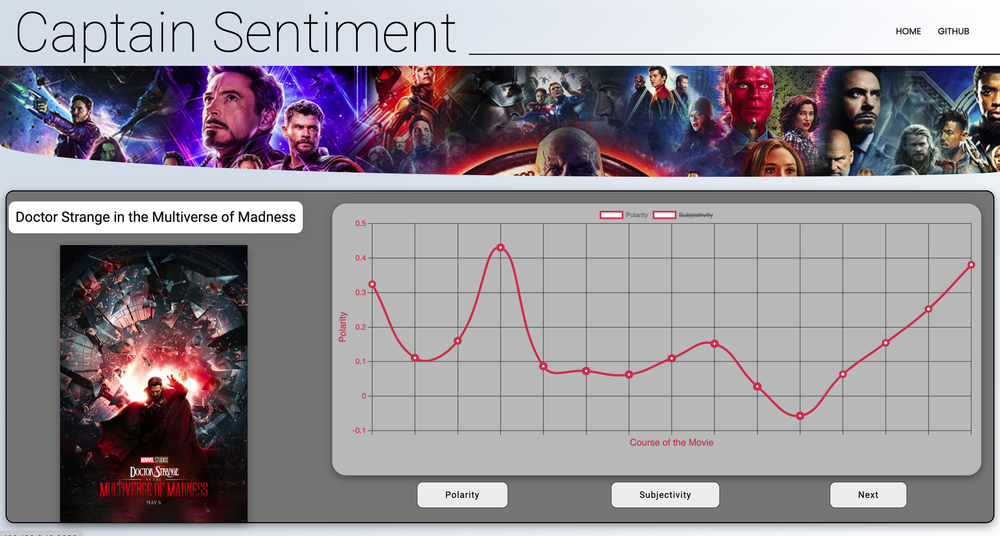
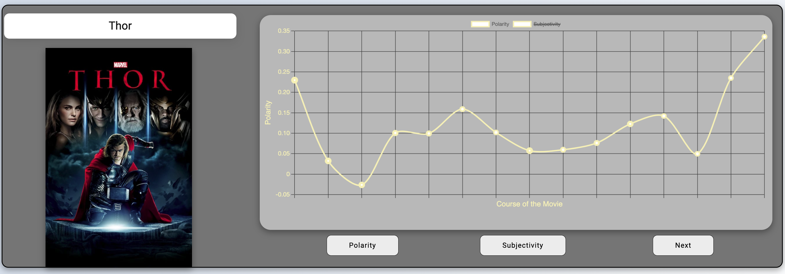

# Captain Sentiment
A sentiment analysis evaluation of all movies in the Marvel Cinematic Universe (MCU), built to showcase patterns in the language of these movies.

## Abstract
The Marvel movies are all contained within an interconnected web of context, events, and character developments. This fact makes it difficult to watch any movie in the universe, without watching other installments to gain context. Despite this, many of the movies (not all; no spoilers though) follow a similar plot line: A hero is discovered or remerges, there is a villain to defeat, the villain is defeated, and the movie is over. Given this predictability in terms of plot, I was curious to see if the choice of words, aka screenwriting, creates similar patterns. In technical terms, is there an overall predictiveness and pattern to the sentiment shared in the movies across 29 and counting films released over the past 13 years?

I present Captain Sentiment, a natural language analysis of the MCU movies using polarity and subjectivity measurements.

## Features of the Website
- Using the React.js framework, all information about movies is centralized to the center of the screen via a custom "movie card" component
- Movies are ordered in the chronological order of the events/context of the MCU. Not a random ordering of the movies
- Load feature that displays one movie and its specific sentiment analysis at a time
- A next button that allows for a user to switch between movies
- Freedom to switch between polarity and subjectivity at the will of the user

Below is an example of the card specific to data collected about the 2011 Thor film.

## To Locally Use The Website and/or Code
- Clone this repository
- Run npm install via the command line
- Run npm start

### Technologies used:
- The Beautiful Soup 4, pandas, Numpy, and Sockets Python libaries for data collection and cleaning
- Python's TextBlob libary for sentiment analysis
- React.js for overall UI creation
- The Chart.js javascript library for the beutiful and robust charts

To streamline the process, for viewers to use this analysis. I have embedded the data locally into this repository. All scripts used to web scrape, collect, clean, and manipulate the raw data can be found in /data. This cleaned data was used with the React.js framework to create the interactive UI you see above.

## Future Direction:
- Hosting this webiste via a cloud service to allow for streamlined acess
- Apply to analysis to smaller and larger movie intervals
- Create two other graphical repersentations of the data
- Develop a CRUD system for users to add there own movie and have it automtiaclly analyzed by my algoirthms

## Reflection
- Generally, the project was an interesting experience to explore movie screenwriting and translate that into a digital medium.
- The concept we are implementing can be applied to a variety of problems. An interesting application would be comedy specials or the sentiment surrounding the word family in the Fast and Furious franchise. 
- My approach is modular and leaves many spaces where additional functionality can be added, either within my current framework or by modifying it.
- Does know that marvel movies are highly repetitive in terms of polarity and subjectivity sentiment scores influence how we perceive the films of the MCU?

## Acknowledgements
I want to thank my fellow interns at Carnegie Mellon Unviersity's REUSE program for watching every single released movie at the time during the summer of 2021. I would not have completed this project without all of you!
