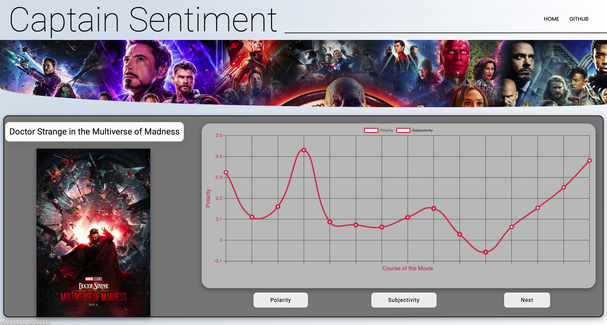

# Captain Sentiment
A sentiment analysis evaluation of all movies in the Marvel Cinematic Universe (MCU), built to showcase patterns in the language of these movies.

## Abstract
The Marvel movies are all contained within an interconnected web of context, events, and character developments. This fact makes it diffcult to watch any given movie in the universe, without watching other installments to gain context. Despite this, much of the movies (not all; no spoliers though) follow a similar plot line: A hero is discovered or remerges, there is a villian to defeat, the villian is defeated, and the movie is over. Given this predictability in terms of plot, I was curious to see, if the choice of words aka screenwriting creates a similar patterns. In technical terms, is there an overall predictivness and pattern to the sentiment shared in the movies across 29 and counting films released over the past 13 years?

I present Captain Sentiment, an natural langauge analysis of the MCU movies using polarity and subjectivity measurements.

## Features of the Website
- Movies order in the chronlogical order of the events/context of the MCU. Not a random ordering of the movies
- Load feature that displays one movie and its personal sentiment analysis at a time
- A next button that allows for a user to switch between movies
- Freedom to switch between polarity and subjectivity at the will of the user

## To Locally Use The Website and/or Code
- Clone this repository
- Run npm install via the command line
- Run npm start

To streamline the process, for viewers to use this analysis. I have embedded the data locally into this repositoiry. All scripts used to webscrape, collect, clean, and manipulate the raw data can be found in /data. This cleaned data was used with the React.js framework to create the interactive UI you see above.

## Future Direction:
- Broader & more complex questions and responses
- Apply to a broader selection of courses and majors
- Improve transition system & state tracking for conversations

## Reflection
- Generally, the project was an interesting experience to explore human conversation and translate that into a digital medium.
- The concept we are implementing can be applied to a variety of problems; it isn’t dependent on ‘course advising’ in particular.
- Our approach is modular and leaves many spaces where additional functionality can be added, either within our current framework or by modifying it.
- Could the responsibilities of academic advisors in 5-10 years realistically be fulfilled by conversational AI?

## Acknowledgements
We want to thank Dr. Matthew Stone for his assistance on this project throughout the semester and for giving us the opportunity to work on this course planning chatbot!
